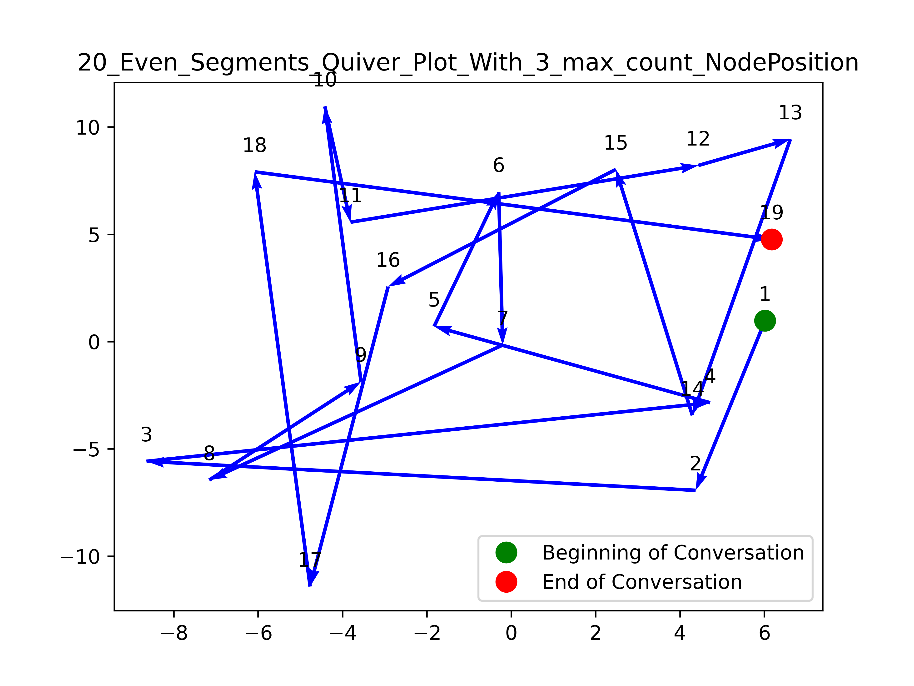
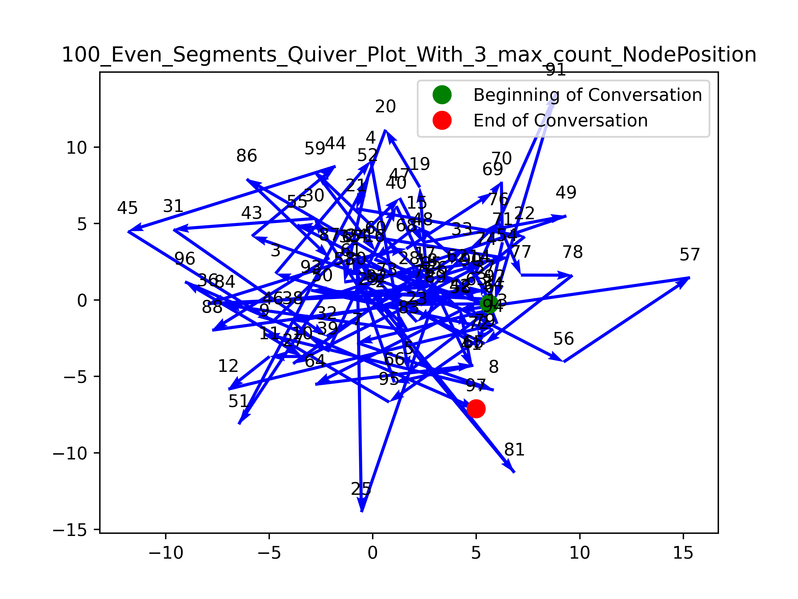

## Master's Project: Conversation Structure Analysis + Visualisation using Podcast Transcripts

In this MSci project The goal is to extract information about conversations by plotting the 
investigating topic evolution 
what key topics were revisited during the conversation? 
are there a set of common trajectories similar- conversations will take

Specifically, we are looking at the structure of conversation under 2 different lenses: as a macroscopic trajectory through a topic space (built from the components of word embeddings) and as a string of microscopic dialogue acts.

Code for the Dialogue Analysis part of this project can be found here: https://github.com/jonas-scholz123/msci-project (Jonas Scholz' Github)

*Key libraries used: sklearn, torch, gensim, nltk, spacy, scipy, pandas, networkx*

## Topic Segmentation and Embeddings
Steps taken so far...

*1) Keyword Extraction*
- Keywords, using PKE implementation of TopicRank
- Nouns, using spacy POS tagger with en_core_web_sm), 
- Bigrams and Trigrams, using NLTK implementation of Collocation Finder

*2) Topic Space Construction*
- Word2Vec implementation with GoogleNews-vectors-negative300 pretrained word embeddings
- FastText implementation with cc.en.300.bin pretrained model

*3) Transcript Segmentation*
- InferSent implementation with arbitrary Cosine similarity cutoff between consecutive sentences
- SliceCast implementation
- Even chunks option for statistical analysis

*4) Segment Graphical Representation Investigation*
- Average of Keyword word-vectors
- The top keyword (in terms of #use cases) word-vector 
- Average of top 3 keyword (in terms of #use cases) word-vectors

*4) Visualisation of Topic Evolution (see next section for what has been done so far)*

Embedding techniques used:
* Sentence embeddings with [InferSent](https://github.com/facebookresearch/InferSent) developed by Facebook Research for utterance-level analysis. 
* Word embeddings with Word2Vec for EDU-level analysis. Using [Google's pretrained Word2Vec model](https://mccormickml.com/2016/04/12/googles-pretrained-word2vec-model-in-python/)

Segmentation methods used: 
* Even Segments 
* [SliceCast](https://github.com/bmmidei/SliceCast)
* [Infersent](https://github.com/facebookresearch/InferSent) with a variable cosine similarity cutoff.

## Discussion Trees: Visualising Conversation Structure and Topic Evolution
This part of the project investigates how we can best visualise the evolution of ideas and nature/flow of conversation from a given podcast transcript. The output graphic will represent a visual snapshot of the conversation, providing a viewer immediate insight to the extent to which different topics were discussed. It will make key themes and points discussed accessible, highlighting which points need to be built out and which have yet to be explored all at just a glance. 
Topic Exploration using trajectory through topic space. 

Attempts made at visualisation so far....
- Plotting the Word Embeddings. 
    Here the keywords extracted from the given transcript using methods listed in 1) are plotted
    in word-embedding space using the cc.en.300 FastText pretrained model. Right is the zoomed-in version of the above plot...
  
   
  And a zoomed-in version...
  
    
    
- Plotting of trajectory through topic space
    The following example was created by segmenting the transcript into (left image) 20 and (right image) 100 even sections, calculating 
    the position of the nodes using the average of the top 3 keywords used in each section...
    
     

    The same trajectory plotted in Word2Vec word-embedding space with key nouns labelled. Here we have (left image) 20 and (right image) 100 even segments using average of 3 top keyword word-vectors as the node position for each segment. 
    
     
    
    
- Plotting of trajectory through 3D topic space
    20_Even_Segments_3D_Quiver_With_3_max_count_NodePosition. 
    
