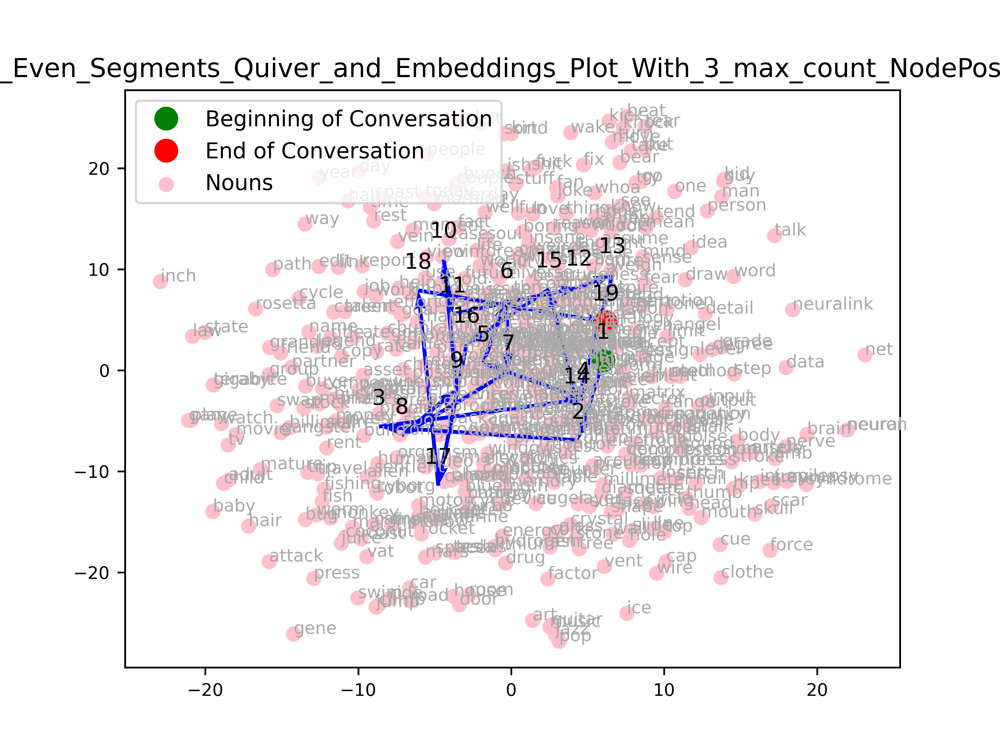
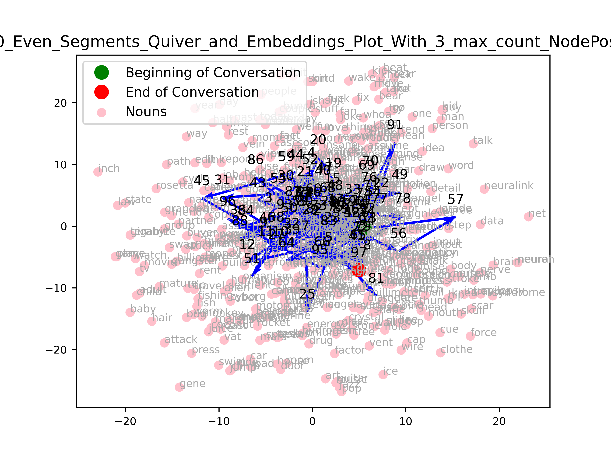

# Master's Project: Conversation Structure Analysis + Visualisation using Podcast Transcripts

In this MSci project we are looking at the structure of human-human conversation under 2 different lenses: as a macroscopic trajectory through a topic space (built from the components of word embeddings) and as a string of microscopic dialogue acts. From the topic space analysis we hope to build a signature graphical representation of the transcript which visualises the evolution of topics discussed, and portrays key information about the given conversation. From the dialogue analysis we hope to answer the question 'What makes Conversation Interesting?'.

I am focussing on the Topic-related tasks of this project (Segmentation, Embeddings, and Visualisation). Code for the Dialogue-Act analysis part of this project can be found on Jonas Scholz' Github: https://github.com/jonas-scholz123/msci-project 

*Key libraries used: sklearn, torch, gensim, nltk, spacy, scipy, pandas, networkx*

# Topic Segmentation and Embeddings
Steps taken so far...

*1) Keyword Extraction*
- Keywords and phrases, using PKE implementation of TopicRank.
- Nouns, using spacy POS tagger with the en_core_web_sm pretrained statistical model. 
- Bigrams and Trigrams, using NLTK implementation of Collocation Finder.

*2) Topic Space Construction*
- Word2Vec implementation with GoogleNews-vectors-negative300 pretrained word embeddings.
- FastText implementation with the cc.en.300.bin pretrained model.

*3) Transcript Segmentation*
- Infersent implementation with arbitrary cosine similarity cutoff between the embeddings of consecutive sentences.
- SliceCast implementation.
- Even chunks, option for statistical analysis.

*4) Graphical Representation*
- Labelled word embeddings of keywords extracted from the given transcript 
- Quiver plot of trajectory taken by conversation through topic space 
- 3D Quiver plot of trajectory taken by conversation through topic space with Sentence Number on the z axis representing time.

## Useful Links
Embedding techniques used:
* Sentence embeddings with [InferSent](https://github.com/facebookresearch/InferSent) developed by Facebook Research for utterance-level analysis, from the paper [Supervised Learning of Universal Sentence Representations from Natural Language Inference Data](https://arxiv.org/abs/1705.02364). 
* Word embeddings with [Word2Vec](https://arxiv.org/abs/1301.3781) for EDU-level analysis, uing [this](https://mccormickml.com/2016/04/12/googles-pretrained-word2vec-model-in-python/) Word2Vec model pretrianed by Google.
* Word embeddings with [FastText](https://github.com/facebookresearch/fastText) based on the paper [Enriching Word Vectors with Subword Information](https://arxiv.org/abs/1607.04606)for EDU-level analysis, using the [cc.en.300.bin](https://fasttext.cc/docs/en/crawl-vectors.html) model.

Segmentation methods used: 
* [SliceCast](https://github.com/bmmidei/SliceCast) implementation from [Neural Text Segmentation on Podcast Transcripts](https://github.com/bmmidei/SliceCast/blob/master/Neural_Text_Segmentation_on_Podcast_Transcripts.pdf).
* [Infersent](https://github.com/facebookresearch/InferSent) sentence embeddings paired with a variable cosine similarity cutoff. Graphical method inspired by paper [Minimum_Cut_Model_for_Spoken_Lecture_Segmentation](https://www.researchgate.net/publication/220873934_Minimum_Cut_Model_for_Spoken_Lecture_Segmentation).

# Discussion Trees: Visualising Conversation Structure and Topic Evolution
This part of the project investigates how one can best visualise the evolution of ideas and nature/flow of conversation from a given podcast transcript. The output graphic will act as a visual snapshot of the conversation, providing a viewer with insight into the extent to which different topics were discussed. The goal is to make key themes and points discussed immediately accessible, highlighting which discussion points need to be built out and which have yet to be explored all at just a glance.

Questions to answer
- Which key topics were revisited during the conversation?
- What was the variation in Dialog Act usage over the course of the conversation (segment-wise), and what does this tell us about the nature/ flow of the conversation? 
- How do we quantify the efficiency of a conversation? (Mostly relevant when analysing business meeting transcripts)
- From the conversation visualisations can we detect a set of common trajectories taken by conversations of simialr styles?

## Notes on, and examples of, Visualisation methods attempted so far...

How the location of a node representing a segment of the transcript is assigned for plots modelling topic evolution:
- Average of all the word-vectors of the keywords present in the given segment
- The word-vector of only the most frequent keyword
- Average of word-vectors corresponding to the three most frequently ocurring keywords in the given segment
How the thickness of the line is assigned (todo):
- Dialog acts? Representation of speaker uncertainty? 

*Plotting the Word Embeddings. 
    Here the keywords extracted from the given transcript using methods listed in 1) are plotted
    in word-embedding space using the cc.en.300 FastText pretrained model. Right is the zoomed-in version of the above plot...
  
   
  And a zoomed-in version...
  
    
    
*Plotting of trajectory through topic space
    The following example was created by segmenting the transcript into (left image) 20 and (right image) 100 even sections, calculating 
    the position of the nodes using the average of the top 3 keywords used in each section...
    
    

   The same trajectory plotted in Word2Vec word-embedding space with key nouns labelled. Here we have (left image) 20 and (right image) 100 even segments using average of 3 top keyword word-vectors as the node position for each segment. 
    
    
    
    
*Plotting of trajectory through 3D topic space
    20_Even_Segments_3D_Quiver_With_3_max_count_NodePosition. 
    

# Code Usage 

Run \_\_main__.py with the following params...

- *path_to_transcript*: local path to the transcript you wish to investigate
- *embedding_method*: Word Embedding of choice. Either 'fasttext' or 'word2vec'. 
- *seg_method*: method of segmentation to use. Options are 'Even' (for splitting it evenly into n segments), 'InferSent' for using InferSent with 
    a certain cosine similarity cut-off, or 'SliceCast'
- *node_location_method*: how to define the node position for a given segment... options are 'total_average' (i.e. calculate
the average of the keyword-vectors present in each segment), '1_max_count' for choosing just the most-frequent keyword's embedding
as the segment node location, or '3_max_count' for taking the word vector average of the three most frequency used keywords 
in each segment as the node location.

- *Even_number_of_segments*: the number of even segments for the transcript to be split into, use when seg_method = 'Even'.
- *InferSent_cos_sim_limit*: the value of cosine similarity at which two consecutive sentences which be deemed as not-similar-enough
to belong to the same section (and hence a new-section tag will be placed between them). Use when for when seg_method = 'InferSent'.

- *Plotting_Segmentation*: True or False, whether you want to plot visualisation of the segmentation task
- *saving_figs*: True or False, whether you want to save figures produced on this run
