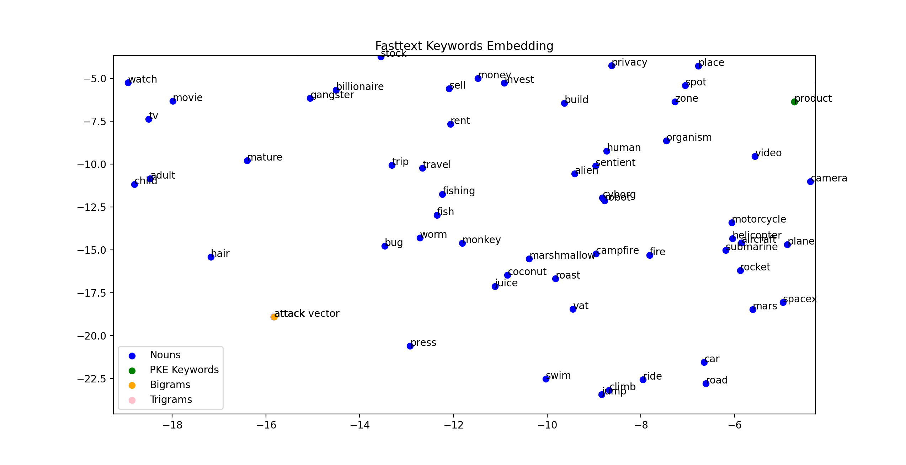
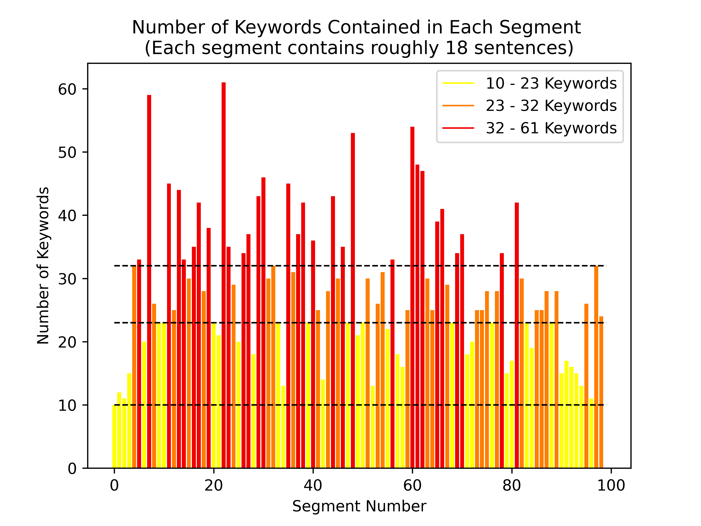

# Master's Project: Conversation Structure Analysis + Visualisation using Podcast Transcripts

In this MSci project we are looking at the structure of human-human conversation under 2 different lenses: as a macroscopic trajectory through a topic space (built from the components of word embeddings) and as a string of microscopic dialogue acts. From the topic space analysis we hope to build a signature graphical representation of the transcript which visualises the evolution of topics discussed, and portrays key information about the given conversation. From the dialogue analysis we hope to answer the question 'What makes Conversation Interesting?'.

I am focussing on the Topic-related tasks of this project (Segmentation, Embeddings, and Visualisation). Code for the Dialogue-Act analysis part of this project can be found on Jonas Scholz' Github: https://github.com/jonas-scholz123/msci-project 

*Key libraries used: sklearn, torch, gensim, nltk, spacy, scipy, pandas, networkx*

# Topic Segmentation and Embeddings
Steps taken so far...

*1) Keyword Extraction*
- Keywords and phrases, using PKE implementation of TopicRank.
- Nouns, using spacy POS tagger with the en_core_web_sm pretrained statistical model. 
- Bigrams and Trigrams, using NLTK implementation of Collocation Finder.

*2) Topic Space Construction*
- Word2Vec implementation with GoogleNews-vectors-negative300 pretrained word embeddings.
- FastText implementation with the cc.en.300.bin pretrained model.

*3) Transcript Segmentation*
- Infersent implementation with arbitrary cosine similarity cutoff between the embeddings of consecutive sentences.
- SliceCast implementation.
- Even chunks, option for statistical analysis.

*4) Graphical Representation*
- Labelled word embeddings of keywords extracted from the given transcript 
- Quiver plot of trajectory taken by conversation through topic space 
- 3D Quiver plot of trajectory taken by conversation through topic space with Sentence Number on the z axis representing time.

## Useful Links
Embedding techniques used:
* Sentence embeddings with [InferSent](https://github.com/facebookresearch/InferSent) developed by Facebook Research for utterance-level analysis, from the paper [Supervised Learning of Universal Sentence Representations from Natural Language Inference Data](https://arxiv.org/abs/1705.02364). 
* Word embeddings with [Word2Vec](https://arxiv.org/abs/1301.3781) for EDU-level analysis, uing [this](https://mccormickml.com/2016/04/12/googles-pretrained-word2vec-model-in-python/) Word2Vec model pretrianed by Google.
* Word embeddings with [FastText](https://github.com/facebookresearch/fastText) based on the paper [Enriching Word Vectors with Subword Information](https://arxiv.org/abs/1607.04606)for EDU-level analysis, using the [cc.en.300.bin](https://fasttext.cc/docs/en/crawl-vectors.html) model.

Segmentation methods used: 
* [SliceCast](https://github.com/bmmidei/SliceCast) implementation from [Neural Text Segmentation on Podcast Transcripts](https://github.com/bmmidei/SliceCast/blob/master/Neural_Text_Segmentation_on_Podcast_Transcripts.pdf).
* [Infersent](https://github.com/facebookresearch/InferSent) sentence embeddings paired with a variable cosine similarity cutoff. Graphical method inspired by paper [Minimum_Cut_Model_for_Spoken_Lecture_Segmentation](https://www.researchgate.net/publication/220873934_Minimum_Cut_Model_for_Spoken_Lecture_Segmentation).

# Discussion Trees: Visualising Conversation Structure and Topic Evolution
This part of the project investigates how one can best visualise the evolution of ideas and nature/flow of conversation from a given podcast transcript. The output graphic will act as a visual snapshot of the conversation, providing a viewer with insight into the extent to which different topics were discussed. The goal is to make key themes and points discussed immediately accessible, highlighting which discussion points need to be built out and which have yet to be explored all at just a glance.

Questions to answer:
- Which key topics were revisited during the conversation?
- What was the variation in Dialog Act usage over the course of the conversation (segment-wise), and what does this tell us about the nature/ flow of the conversation? 
- How do we quantify the efficiency of a conversation? (Mostly relevant when analysing business meeting transcripts)
- From the conversation visualisations can we detect a set of common trajectories taken by conversations of similar styles?

## Word Embedding-based Visualisation methods attempted so far...
***Please note that this is a work in progress!***

How the location of a node representing a segment of the transcript is assigned for plots modelling topic evolution:
- Average of all the word-vectors of the keywords present in the given segment
- The word-vector of only the most frequent keyword from the segment
- Average of word-vectors corresponding to the three most frequently ocurring keywords in the given segment

How the thickness of the line is assigned (todo):
- Dialog acts? Representation of speaker uncertainty? 

**Plotting the Word Embeddings**

   Here the keywords are extracted from the given transcript using methods listed in 1) and are plotted
   in word-embedding space using the cc.en.300 FastText pretrained model.
  
   
  And a zoomed-in version...
  
  And another...
  
   
**Plotting of Trajectory Through Topic Space**

   The following example was created by segmenting the transcript into (left image) 20 and (right image) 100 even sections, calculating 
   the position of the nodes using the average of the top 3 keywords used in each section...
    
    

   The same trajectory plotted in Word2Vec word-embedding space with key nouns labelled. Here we have (left image) 20- and (right image) 100-even segments using average of 3 top keyword word-vectors as the node position for each segment. 
    
    
    
    
**Plotting of Trajectory Through 3D Topic Space**

20_Even_Segments_3D_Quiver_With_3_max_count_NodePosition 

**Plotting of Trajectory Through Topic Space for two Transcripts on the same background word embedding**

Word embedding background created using FastText on the two transcript (Joe Rogan + Elon Musk, and Joe Rogan + Jack Dorsey).
 

**Conversation Trajectory with 'Richness' of Segment**

Added variable sizing for the text labels of Nodes with multiple connections, where the size of text reflects the number 
of connections the node has / the size of the cluster. Words in bold correspond to node locations visited more than once.
Added colour to the lines to reflect the number of keywords contained in each segment. More keywords contained means 
'richer' conversation in this section, but also means there is a larger uncertainty on the topic of this segment in that 
there were more keywords which could have been chosen to define the segment node position. Both plotted on their shared
 word embedding space. 

Corresponding histograms for the number of keywords contained in each segment of the transcripts ... 
a) Joe Rogan & Elon Musk                                         b) Joe Rogan & Jack Dorsey

 

Elon Musk Trajectory...

Jack Dorsey Trajectory...

**Plotting of Speaker-Indepedent Trajectory Through Topic Space**

Separated the utterances spoken by each member of the conversation and plotted their independent topical trajectories. Example
given here is for the Joe Rogan & Elon Musk interview.

## A Second method of Visualisation: Back to Basics
*Dialogue Act Simple Line*

Testing basic hypothesis that Questions indicate a topic change in the conversation. Here, I plot a node every time the speaker changes.
 I check through all dialogue acts used by a speaker in their set of consecutive utterances and if they used a Question 
 ("Wh-Question", "Yes-No-Question", "Declarative Yes-No-Question", "Declarative Wh-Question")
I shift the trajectory one step in the y direction and annotate the node with the Topic currently being discussed. If no
questions were asked then I assume the overall topic being discussed has not changed and continue plotting the nodes
along the horizontal axis. Here only the first 200 utterances in the transript are considered. I also
colour the lines to reflect the current speaker -> from this we can see that all of the Questions asked in the first
200 lines of the transcript are spoken by Joe Rogan (and hence maybe he introduces all new topics as he is leading
the conversation?).

*Topic Changes Simple Line*

Here I instead shift the line up when we detect the topic of conversation has changed. We can see that although 
Elon Musk does not ask many questions, he DOES lead the conversation in terms of its topical evolution (all the blue lines
 on the steps). Data presented in table format below on the number of Topics introduced by each speaker in the conversetion
 as a whole.

| Speaker   |   Total #Utterances |   Total #Questions Asked |   Total #Statements |   Number of Topics Introduced |   #Topics introduced by Statement |   #Topics introduced by Question |
|:----------|--------------------:|-------------------------:|--------------------:|------------------------------:|----------------------------------:|---------------------------------:|
| Joe Rogan |                 854 |                      161 |                 519 |                            74 |                                50 |                               20 |
| Elon Musk |                 847 |                       29 |                 591 |                            80 |                                64 |                                3 |

*Topic Changes Line with Shift*

Take the simple line plot above and introduce a horizontal shift when a previous topic is detected. 

...and a simplified version...

*Topic Changes Line with Shift - Comparison between different interviews*

And now similar but for the ENTIRE conversations between a) Joe Rogan and Jack Dorsey, b) Joe Rogan and Elon Musk

 

Now introducing a logarithmic x-axis scale so can view the dense information on the LHS of the above graphs better....

 

Unreadable graph, but noticing the difference in pattern between that of above two conversations, 
and the interview between Joe Rogan and Kanye West...

# Code Usage 

Run \_\_main__.py with the following params

- *path_to_transcript*: Local path to the transcript you wish to investigate.
- *embedding_method*: Word Embedding of choice. Options are 'fasttext' or 'word2vec'. 
- *seg_method*: Method of segmentation to use. Options are 'Even' (for splitting it evenly into n segments), 'InferSent' for using InferSent with 
    a certain cosine similarity cut-off, or 'SliceCast'.
- *node_location_method*: How to define the node position for a given segment... options are 'total_average' (i.e. calculate
the average of the keyword-vectors present in each segment), '1_max_count' for choosing just the most-frequent keyword's embedding
as the segment node location, or '3_max_count' for taking the word vector average of the three most frequency used keywords 
in each segment as the node location.

- *Even_number_of_segments*: The number of even segments for the transcript to be split into, use when seg_method = 'Even'.
- *InferSent_cos_sim_limit*: The value of cosine similarity at which two consecutive sentences which be deemed as not-similar-enough
to belong to the same section (and hence a new-section tag will be placed between them). Use when for when seg_method = 'InferSent'.

- *Plotting_Segmentation*: True or False, whether you want to plot visualisation of the segmentation task.
- *saving_figs*: True or False, whether you want to save figures produced on this  run.
